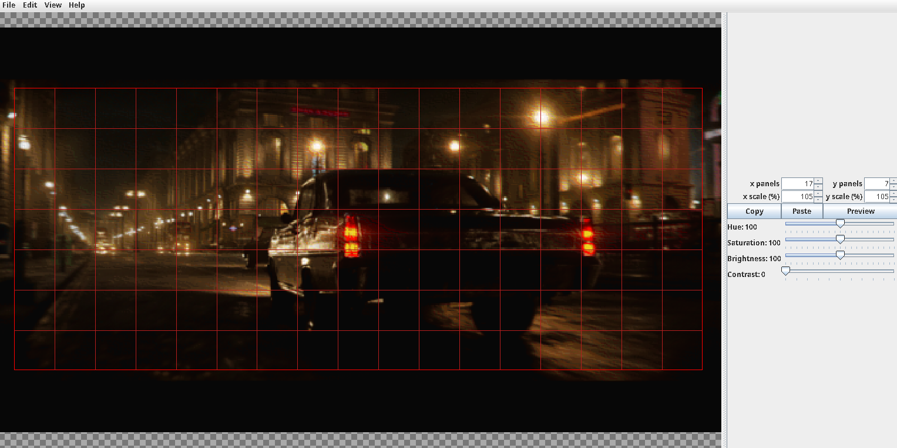

# Painter Image Processor
This application is meant to be used alongside the [fabric painter mod](https://github.com/kowandiki/painter).

This meant to be used for the [ArtMap](https://gitlab.com/BlockStack/ArtMap) plugin
## Dependencies
This application **requires** ImageMagick to be in your path.

## Features
 - resize image as you change the desired in-game size
 - automatically convert images to the appropriate color-palette
 - many dithering options
 - option to stretch or crop the image
 - preview the image in a larger window
 - generate instructions to be used with the [fabric painter mod](https://github.com/kowandiki/painter)

## How to Use
click "select image" and choose an image from your file system, or paste from your clipboard. From there, just mess with the settings and drag the selection box around until you get something you like. 
Do note that `x panels` and `y panels` correspond to the number of maps in game, so a value of 2 for both would correspond to a 2x2 in game.

[image](https://www.artstation.com/artwork/V2VyzN)

This program saves a folder containing instructions and optionally picture guides for painting each panel. The Fabric Painter mod does not need the images, but if you are painting by hand they are highly recommended.